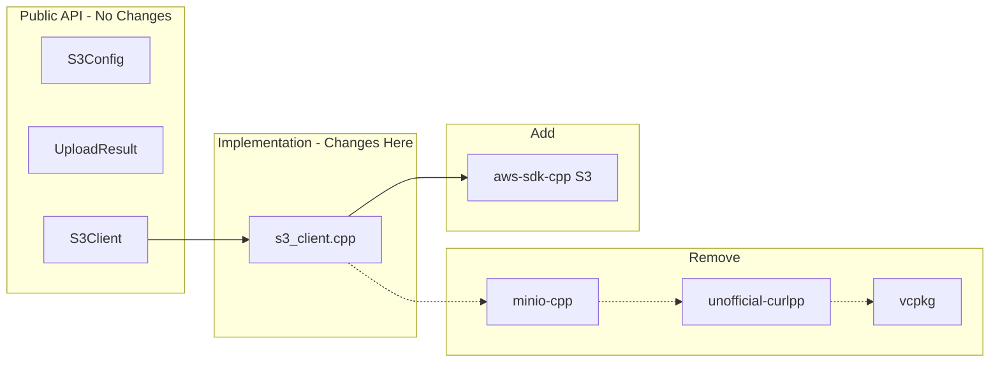

# Migrate from minio-cpp to aws-sdk-cpp S3

## Motivation

`minio-cpp` requires `unofficial-curlpp` from vcpkg, which:

- Prevents building `axon_uploader` locally and in CI
- Blocks test coverage for the uploader module
- Adds complex package manager dependencies

`aws-sdk-cpp` S3 is available via apt (`libaws-cpp-sdk-s3-dev`) with no vcpkg needed.

## Architecture

The migration is isolated to [`cpp/axon_uploader/s3_client.cpp`](cpp/axon_uploader/s3_client.cpp). The public API in [`s3_client.hpp`](cpp/axon_uploader/s3_client.hpp) remains unchanged.




## API Mapping

| minio-cpp | aws-sdk-cpp | Notes ||-----------|-------------|-------|| `minio::s3::Client` | `Aws::S3::S3Client` | Main client || `minio::creds::StaticProvider` | `Aws::Auth::AWSCredentials` | Credentials || `minio::s3::BaseUrl` | `Aws::Client::ClientConfiguration` | Endpoint config || `UploadObject()` | `PutObject()` or `TransferManager` | File upload || `StatObject()` | `HeadObject()` | Object metadata || Progress callback | `TransferManager::UploadProgressCallback` | Progress |

## Implementation Steps

### Step 1: Update CMakeLists.txt

Replace minio-cpp FetchContent with aws-sdk-cpp find_package:

```cmake
# Remove: FetchContent for minio-cpp (lines 40-67)
# Add:
find_package(AWSSDK REQUIRED COMPONENTS s3 transfer)

target_link_libraries(axon_uploader PUBLIC
    ${AWSSDK_LINK_LIBRARIES}  # replaces miniocpp::miniocpp
    SQLite::SQLite3
    CURL::libcurl
    OpenSSL::SSL
    OpenSSL::Crypto
)
```


### Step 2: Update s3_client.cpp

Replace minio-cpp includes and implementation:

```cpp
// Remove:
#include <miniocpp/client.h>

// Add:
#include <aws/core/Aws.h>
#include <aws/s3/S3Client.h>
#include <aws/s3/model/PutObjectRequest.h>
#include <aws/s3/model/HeadObjectRequest.h>
#include <aws/transfer/TransferManager.h>
```

Key implementation changes:

1. **Impl class members:**
```cpp
class S3Client::Impl {
public:
  S3Config config;
  Aws::SDKOptions sdk_options;
  std::shared_ptr<Aws::S3::S3Client> client;
  std::shared_ptr<Aws::Transfer::TransferManager> transfer_manager;
};
```


2. **Client initialization:**
```cpp
void initClient() {
  Aws::InitAPI(sdk_options);
  
  Aws::Client::ClientConfiguration client_config;
  client_config.region = config.region;
  client_config.endpointOverride = config.endpoint_url;
  client_config.verifySSL = config.verify_ssl;
  client_config.connectTimeoutMs = config.connect_timeout_ms;
  client_config.requestTimeoutMs = config.request_timeout_ms;
  
  Aws::Auth::AWSCredentials credentials(config.access_key, config.secret_key);
  client = std::make_shared<Aws::S3::S3Client>(credentials, client_config);
}
```


3. **Upload implementation:**
```cpp
// Use TransferManager for automatic multipart + progress
auto transfer_config = Aws::Transfer::TransferManagerConfiguration(executor);
transfer_config.s3Client = client;
transfer_config.uploadProgressCallback = [&](/*...*/) { /*progress*/ };

transfer_manager = Aws::Transfer::TransferManager::Create(transfer_config);
auto handle = transfer_manager->UploadFile(local_path, bucket, s3_key, /*...*/);
handle->WaitUntilFinished();
```


4. **Destructor cleanup:**
```cpp
S3Client::~S3Client() {
  impl_->transfer_manager.reset();
  impl_->client.reset();
  Aws::ShutdownAPI(impl_->sdk_options);
}
```


### Step 3: Update CI Workflow

In [`coverage-cpp.yml`](.github/workflows/coverage-cpp.yml):

```yaml
- name: Install dependencies
  run: |
    sudo apt-get install -y \
      libaws-cpp-sdk-s3-dev \
      libaws-cpp-sdk-transfer-dev \
      # ... other deps
```

Re-enable the uploader coverage step.

### Step 4: Update Local Development

Add to [`cpp/README.md`](cpp/README.md):

```bash
# Ubuntu/Debian
sudo apt-get install libaws-cpp-sdk-s3-dev libaws-cpp-sdk-transfer-dev

# macOS (Homebrew)
brew install aws-sdk-cpp
```


## Testing Strategy

1. **Unit tests** - Existing tests in `test_upload_queue.cpp`, `test_retry_handler.cpp`, `test_state_manager.cpp` should pass without changes (they mock S3Client)
2. **Integration test** - `test_edge_uploader.cpp` tests against real MinIO and should work unchanged since it uses the public API
3. **Manual verification:**

- Upload to MinIO locally
- Upload to real AWS S3
- Verify multipart upload for large files (>100MB)
- Verify progress callbacks work

## Rollback Plan

If issues arise, keep minio-cpp as a compile-time option:

```cmake
option(USE_AWS_SDK "Use AWS SDK instead of minio-cpp" ON)
if(USE_AWS_SDK)
  # aws-sdk-cpp path
else()
  # minio-cpp path (requires vcpkg)
endif()
```


## Files to Modify

| File | Changes ||------|---------|| [`cpp/axon_uploader/CMakeLists.txt`](cpp/axon_uploader/CMakeLists.txt) | Replace minio-cpp with aws-sdk-cpp || [`cpp/axon_uploader/s3_client.cpp`](cpp/axon_uploader/s3_client.cpp) | Rewrite implementation || [`cpp/axon_uploader/s3_client.hpp`](cpp/axon_uploader/s3_client.hpp) | Update doc comment only |