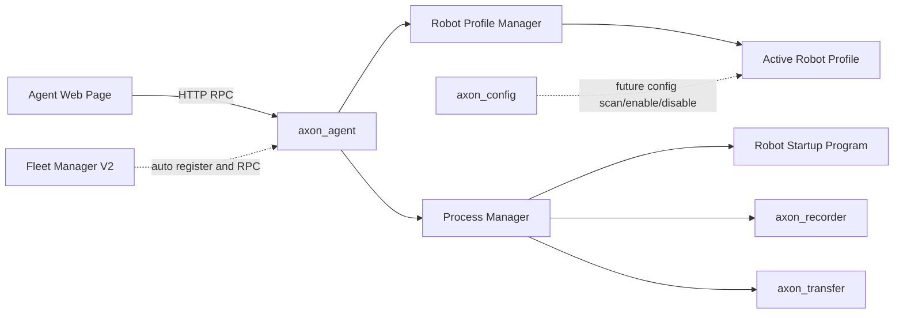
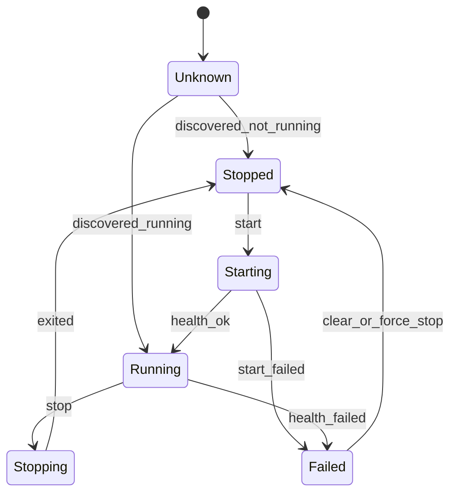

# Axon Agent 模块方案

## 可行性结论

该方向可行，而且更适合定位为开机自启的边缘侧 Supervisor，例如 `apps/axon_agent/`，不要塞进 `axon_recorder`。`axon_agent` 负责拉起和管理工控机启动程序、`axon_recorder`、`axon_transfer`；这些被管理程序保持独立进程，agent 崩溃后由 systemd 等机制自动重启，并通过 pid 文件、进程探测、健康检查或本地 RPC 重新接管状态。

首版开发边界明确为只新增 `axon_agent` 相关代码和页面，不修改 `axon_recorder`、`axon_transfer`、`axon_config` 或其现有 RPC/配置语义。

现有 recorder 的 `apps/axon_recorder/src/http/rpc_handlers.hpp`、`apps/axon_recorder/src/http/http_server.cpp` 和 `apps/axon_recorder/src/state/state_machine.hpp` 可以作为结构参考：HTTP 层只做 JSON 校验和路由，业务通过回调或 service 类注入，状态由独立状态机管理。

## 推荐架构



核心分层：

- `AgentService`：统一入口，维护 active profile、被管理组件清单、状态汇总和 RPC handler。
- `RobotProfileManager`：扫描 robot profile 目录，只读取 `adapter.yaml` 展示可选机器人；同一时刻只允许一个 active profile。
- `ManagedProcess`：描述一个可管理程序，例如工控机启动程序、`axon_recorder`、`axon_transfer`，包含命令、参数、工作目录、环境变量、健康检查和停止策略。
- `ProcessManager`：统一拉起、停止、强杀、日志捕获、pid/process group 管理，并支持 agent 重启后的重新发现。
- 配置管理边界：agent 不内置 `ConfigManager`，也不直接管理 scan、enable、disable；配置发现、启停、版本和差异后续统一交给 `axon_config`。
- `AgentHttpServer`：提供独立页面和 HTTP/RPC API，可按 recorder 的 RPC envelope 风格返回 `{ success, message, data }`。

## V1 使用场景

首版目标是本机可用、可恢复、可观察：

- `axon_agent` 通过 systemd 开机自启，并设置 `Restart=always`。
- agent 维护一个独立页面，先展示可选 robot profile，再用于查看和操作工控机启动程序、recorder、transfer 状态。
- 工控机启动程序、recorder、transfer 都是独立进程，agent 只做 supervisor，不把录制逻辑或机器人启动逻辑并进同一进程。
- agent 崩溃重启后，通过 pid 文件、进程名/启动指纹、健康检查端口和 recorder `/rpc/state` 重新接管状态。
- 同一时刻只允许一个 active profile；切换 profile 前必须停止或强制停止当前 profile 管理的工控机程序、recorder 和 transfer。
- 选择 profile 时只读取 `adapter.yaml`。如果 `auto_start: true`，选中后立即加载机器人 `.so` 并启动 `robot_startup`；如果已经探测到 `robot_startup` 正在运行，则不重复启动并在响应中标记 skipped。如果 `auto_start` 为 `false` 或未定义，则等用户点击启动机器人时再加载对应动态库。
- 用户启动后台服务时，agent 使用 active profile 下的 `recorder.yaml` 和 `transfer.yaml` 拉起 recorder/transfer。
- 首版不做上层自动注册，不做远程插件下载，不做复杂权限体系；但 API 和配置格式为 V2 预留字段。

推荐 robot profile 目录：

```text
/opt/axon/robots/
  robot_a/
    adapter.yaml
    recorder.yaml
    transfer.yaml
    scripts/
      startup.sh
    config/
      urdf/
      sensors/
```

## 后续适配器接口

不要直接复用 recorder 的 middleware ABI。它面向 topic subscribe/publish 和 MCAP 写入，语义不对。

如果 V2 需要机器人型号适配器，可在 agent 内新增 `RobotAdapter`：对适配器开发者暴露 C++ 抽象类，动态库边界采用 C ABI factory 或 vtable。首版可以先用配置化 `ManagedProcess` 拉脚本，等控制逻辑复杂后再引入插件 ABI。

适配器发现建议：

- agent 启动参数支持 `--robot-profile-path /path/to/robots`，在该目录下按固定规则扫描子目录。
- 每个 robot profile 目录包含 `adapter.yaml`，声明 `adapter_id`、`robot_model`、`library`、`abi_version`、`entry_symbol`、`auto_start`、能力列表和默认 managed processes。
- agent 先读取 `adapter.yaml` 做过滤和页面展示，再按 active profile 与 `auto_start` 规则 `dlopen` 指定 `.so`；不要盲目递归加载目录里的所有 `.so`。
- 同一次启动只加载一个 adapter，可由 `--robot-model`、`--adapter-id` 或明确 `--adapter-lib` 选择；匹配多个时启动失败并要求显式指定。
- 动态库导出稳定 C 符号，例如 `axon_agent_get_adapter_descriptor()`、`axon_agent_create_adapter()`、`axon_agent_destroy_adapter()`；插件内部可以继承 C++ `RobotAdapter`，但异常、STL 对象和内存释放不要跨 ABI 边界。
- 首版 adapter 最好只负责提供进程定义、健康检查、report 和少量控制逻辑；如果厂商 SDK 不稳定或会阻塞，优先让 adapter 启动独立子进程，而不是把 SDK 长期跑在 agent 进程内。

`adapter.yaml` 示例：

```yaml
adapter_id: robot_a
robot_model: model_a
library: libaxon_robot_a.so
abi_version: 1
entry_symbol: axon_agent_create_adapter
auto_start: false
capabilities:
  - startup_program
  - health_report
  - recorder_profile
```

managed process 字段：

```yaml
process:
  executable: axon-recorder
  args:
    - --config
    - recorder.yaml
  working_directory: .
  env:
    AXON_PROFILE: robot_a
  pid_file: robot_a_recorder.pid
  metadata_file: robot_a_recorder.json
  stdout_log: logs/robot_a_recorder.stdout.log
  stderr_log: logs/robot_a_recorder.stderr.log
  stop_timeout_sec: 5
  fingerprint: optional-explicit-fingerprint
```

`adapter.yaml` 下的 `managed_processes.<process_id>` 使用同一组字段。`working_directory` 的相对路径按 profile 根目录解析；`pid_file`、`metadata_file`、`stdout_log`、`stderr_log` 的相对路径按 agent `state_dir` 解析。未配置 `pid_file`、`metadata_file` 和日志路径时，agent 会自动按 `profile_id + process_id` 生成隔离路径。

## 状态与 RPC 语义

建议按组件维护状态，而不是只有一个 robot 状态：



RPC 建议：

- `GET /agent/rpc/state`：返回 agent 自身、所有 managed processes、最近错误和版本信息。
- `GET /agent/rpc/report`：返回汇总报告，例如 robot program、recorder、transfer、磁盘和上传状态。
- `GET /agent/rpc/profiles`：列出扫描到的 robot profiles，只基于 `adapter.yaml` 返回基本信息。
- `POST /agent/rpc/profile/select`：选择 active profile；跨 profile 切换前必须没有 managed process 处于运行态，否则返回阻塞进程列表；若 `auto_start: true`，选择后立即加载 adapter `.so` 并启动 `robot_startup`，已运行则跳过重复启动。
- `POST /agent/rpc/process/start`：按 `process_id` 拉起配置好的程序，例如 `robot_startup`、`recorder`、`transfer`。
- `POST /agent/rpc/process/stop`：按 `process_id` 优雅停止。
- `POST /agent/rpc/process/force_stop`：按 `process_id` 强制停止进程组并清理状态。
- `POST /agent/rpc/process/log`：读取 managed process 的 stdout/stderr 日志尾部，参数为 `process_id`、`stream` 和 `tail_bytes`，用于页面排障和运行闭环观察。

agent 不提供 `config/scan`、`config/enable`、`config/disable` RPC。这些能力不属于 supervisor 边界，后续由 `axon_config` 独立提供，agent 页面如需展示配置状态也应通过 `axon_config` 的公开接口读取。

## 进程与环境变量安全策略

agent 会拉起长期运行程序和脚本，必须把进程管理作为一等模块处理：

- 使用 `posix_spawn` 或 `fork` + `execve`，不要用 `system()` 或拼接 shell 命令。
- 所有参数用 argv 数组传入，不通过 shell 字符串解释。
- 环境变量采用 allowlist 或显式构造，默认不继承完整父进程环境；必要项如 `PATH`、`HOME`、`ROS_DISTRO`、`AMENT_PREFIX_PATH`、`LD_LIBRARY_PATH` 由配置声明。
- 为每次 start 创建独立 process group，`stop` 先 `SIGTERM` 整个进程组，超时后 `SIGKILL`；`force_stop` 直接进入强制路径。
- 固定 working directory、stdout/stderr 捕获、退出码记录、超时策略和僵尸进程回收。
- 记录 pid、process group、启动时间、命令指纹和健康检查配置；pid、metadata 和日志路径按 `profile_id + process_id` 隔离，便于 agent 重启后重新发现且避免 profile 切换时串状态。
- 避免被管理程序任意修改 agent 进程全局环境；如果必须 source ROS setup，推荐通过 wrapper 脚本生成明确环境，或由配置文件声明环境键值。

## 与 recorder 的关系

保持松耦合：agent 可以启动 recorder 进程，也可以调用 recorder 自己的 HTTP/WS RPC，但不把 recorder 的高吞吐写盘逻辑并进 agent。active profile 下的 `recorder.yaml` 只规定录制话题、keystone path、插件路径、端口、输出目录等启动或默认配置；一次性任务配置仍然由上游 keystone 下发给 recorder，不固化在 robot profile 里。

典型流程是 agent 先启动工控机程序，确认健康后启动 recorder，再由页面或上层系统调用 recorder `/rpc/config` 和 `/rpc/begin`。停止时先 recorder `/rpc/finish`，再停止工控机程序。这样 agent、recorder 和工控机程序互相独立，任何一方崩溃都可以被重新发现或重启。

## 与 axon_config 的关系

配置管理从 agent 边界中移出。agent 只消费 active profile 下的 `adapter.yaml`、`recorder.yaml`、`transfer.yaml` 来构造启动参数，不负责扫描配置、启用配置、禁用配置、版本管理或配置差异。

后续配置相关能力由 `axon_config` 负责，包括 config scan/enable/disable、配置缓存、配置版本、配置差异和配置校验。agent 可以在页面或 report 中展示来自 `axon_config` 的只读状态，但不应该复制 `axon_config` 的业务语义或持久化模型。

## V2 演进方向

第二阶段再加入上层自动注册和 fleet 协同：

- agent 开机后向上层平台注册，带 robot id、device id、版本、能力列表、内网地址和健康状态。
- 上层可以下发进程配置、recorder 配置、上传策略或机器人型号适配信息；其中配置生命周期由 `axon_config` 承担。
- agent 增加认证、授权和审计日志。
- 可选增加 robot adapter 插件 ABI，用于更复杂的机器人型号适配。
- 可选增加统一反向代理或 gateway，将 agent 页面、agent RPC、recorder RPC 和 transfer 状态统一在一个对外入口下。

## 初步落地范围

首版建议只做：独立 `axon_agent`、systemd 开机自启、robot profile 扫描、active profile 选择、`auto_start` 控制的 adapter 加载与 `robot_startup` 启动、配置化 managed process、进程树管理、agent 重启后接管、独立本地页面。自动注册、远程动态库 URL、复杂 robot adapter、统一 fleet 权限放到第二阶段，因为它们涉及鉴权、持久化、审计和安全更新。配置 scan/enable/disable、配置历史差异和配置版本管理不进入 agent 路线，由 `axon_config` 单独演进。

## 当前实现状态

当前仓库已有 V1 最小验证骨架：

- `apps/axon_agent/`：C++ `axon-agent` 独立 app。
- `apps/axon_agent/examples/robots/demo_robot/`：demo robot profile。
- `apps/axon_agent/scripts/agent_nicegui_panel.py`：NiceGUI 最小验证页面，供上游参考。
- 顶层 `CMakeLists.txt` 已接入 `apps/axon_agent`。

已验证过的基础命令：

```bash
cmake -S apps/axon_agent -B build/axon_agent_dev
cmake --build build/axon_agent_dev -j2
python3 -m py_compile apps/axon_agent/scripts/agent_nicegui_panel.py
```
