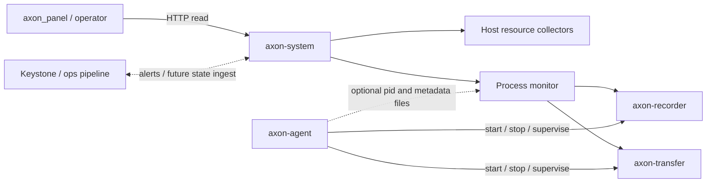
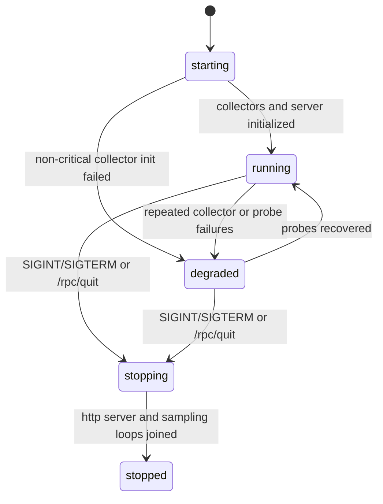

# Axon System 模块设计

## 结论

`axon_system` 应定位为边缘侧只读观测服务，负责主机资源指标、Axon 关键进程健康聚合和后续告警投递。它不替代 `axon_agent` 的进程编排职责，也不把 ROS middleware、recorder 或 transfer 的业务逻辑并入自身进程。

首版应先完成独立服务骨架和稳定本地 API，再分阶段加入资源采集、进程健康、告警投递。这样可以满足 #79 的构建和生命周期验收，同时为 #80、#81、#82 留出清晰扩展点。

## Issue 映射

| Issue | 目标 | 设计落点 |
| --- | --- | --- |
| #79 | 新增 `axon_system` 监控服务 | `apps/axon_system` 独立 app、root CMake 接入、dispatcher 子命令、启动/状态/退出模型 |
| #80 | 采集主机资源指标 | CPU、memory、disk、network collector，统一单位和采样周期 |
| #81 | 暴露 recorder 和 transfer 健康 | process monitor 聚合 `axon-recorder`、`axon-transfer` 状态，并关联进程级资源 |
| #82 | 接入运营告警链路 | alert evaluator、alert event model、delivery sink、失败诊断和重试 |

## 职责边界

`axon_system` 负责：

- 汇总服务自身状态，例如版本、pid、启动时间、运行时长和最近采样时间。
- 周期采集主机 CPU、内存、磁盘和网络指标。
- 发现并评估 `axon-recorder`、`axon-transfer` 的健康状态。
- 将进程健康和主机资源状态组成一个面向操作人员和上层系统的本地 API。
- 根据规则产生告警事件，并交给本地日志或运营管道 sink 投递。

`axon_system` 不负责：

- 启动、停止、重启 recorder、transfer 或机器人程序。这是 `axon_agent` 的职责。
- 直接加载 ROS1/ROS2/Zenoh/UDP middleware 插件。
- 修改 recorder/transfer 的配置、任务或上传行为。
- 在 V1 中提供复杂 UI。`axon_panel` 或 Keystone 可以消费它的 API。

## 与现有组件的关系



`axon_agent` 已经有 managed process 的启动、停止和健康检查能力。`axon_system` 不应复制这套控制面，而是作为独立观测面：

- 如果进程由 agent 管理，`axon_system` 可以读取 agent 生成的 pid 或 metadata 文件。
- 如果没有 agent，`axon_system` 仍能通过 `/proc` 和进程匹配发现 `axon-recorder`、`axon-transfer`。
- recorder 的 `/rpc/state` 可作为增强健康来源；transfer 当前没有统一本地健康 API，V1 先用进程存在性和资源指标判断。

## 推荐目录结构

```text
apps/axon_system/
  CMakeLists.txt
  README.md
  src/
    main.cpp
    rpc_response.hpp
    system_service.hpp
    system_service.cpp
    http_server.hpp
    http_server.cpp
    resource_collector.hpp
    resource_collector.cpp
    procfs_reader.hpp
    procfs_reader.cpp
    process_monitor.hpp
    process_monitor.cpp
    alert_evaluator.hpp
    alert_evaluator.cpp
    alert_sink.hpp
    alert_sink.cpp
    system_config.hpp
    system_config.cpp
  test/
    CMakeLists.txt
    test_resource_collector.cpp
    test_process_monitor.cpp
    test_system_service.cpp
    test_alert_evaluator.cpp
```

构建依赖保持轻量：

- C++17、`Threads::Threads`。
- `Boost::system` 和 Boost.Beast/Asio，用于本地 HTTP 服务和可选 recorder health probe。
- `nlohmann_json`，保持和现有 RPC envelope 一致。
- `yaml-cpp` 只在引入配置文件阶段使用，不作为 #79 服务骨架的前置条件。
- 不链接 ROS、recorder core、middleware target 或 uploader target。

## 服务生命周期

服务状态建议只描述 `axon-system` 自身进程生命周期：



关键规则：

- 单个 collector 失败不能让整个服务不可用。
- `/health` 只反映 `axon-system` HTTP 服务和采样循环是否活着。
- `/rpc/state` 返回完整状态，包括 collector 失败和进程健康失败。
- `SIGINT`、`SIGTERM` 和 `POST /rpc/quit` 都走同一条 shutdown path。

## 本地 API

所有 RPC 接口使用现有风格：

```json
{
  "success": true,
  "message": "ok",
  "data": {}
}
```

V1 接口：

| Method | Path | 用途 |
| --- | --- | --- |
| `GET` | `/health` | 轻量健康检查，供 systemd、panel 或本地脚本使用 |
| `GET` | `/rpc/state` | 返回服务状态、最新资源指标、进程健康、告警摘要 |
| `GET` | `/rpc/metrics` | 返回最新主机和进程级指标 |
| `GET` | `/rpc/processes` | 返回 recorder 和 transfer 的健康详情 |
| `GET` | `/rpc/alerts` | 返回当前 firing/resolved 告警和最近投递错误 |
| `POST` | `/rpc/quit` | 请求优雅退出 |

默认监听建议：

```text
axon-system --host 127.0.0.1 --port 8091 --state-dir /var/lib/axon/system
```

默认绑定 `127.0.0.1`，因为该服务会暴露主机和进程状态。需要远程读取时通过配置显式绑定 `0.0.0.0`，或由 panel/agent 做本地代理。

`/rpc/state` 示例：

```json
{
  "success": true,
  "message": "ok",
  "data": {
    "service": {
      "name": "axon-system",
      "version": "0.4.0-dev",
      "state": "running",
      "pid": 1234,
      "started_at": "2026-05-12T08:00:00Z",
      "uptime_sec": 42,
      "state_dir": "/var/lib/axon/system",
      "sample_cadence_ms": {
        "resources": 1000,
        "processes": 2000,
        "alerts": 5000
      }
    },
    "resources": {
      "collected_at": "2026-05-12T08:00:42Z",
      "cpu": {"available": true, "usage_percent": 18.6, "load1": 0.92},
      "memory": {"available": true, "total_bytes": 33554432000, "used_bytes": 12884901888},
      "disk": [
        {"id": "recording_data", "path": "/axon/data", "available_bytes": 1099511627776}
      ],
      "network": [
        {"interface": "eth0", "rx_bytes_per_sec": 8123, "tx_bytes_per_sec": 2048}
      ]
    },
    "processes": {
      "recorder": {
        "status": "healthy",
        "pid": 2201,
        "source": "pid_file",
        "health": {"type": "http", "reachable": true, "state": "IDLE"},
        "resources": {"cpu_percent": 4.1, "rss_bytes": 268435456}
      },
      "transfer": {
        "status": "unavailable",
        "pid": null,
        "source": "process_match",
        "message": "process not found"
      }
    },
    "alerts": {
      "firing_count": 1,
      "last_delivery_error": ""
    }
  }
}
```

## 主机资源指标

统一采样周期和单位：

| 类别 | Linux 数据源 | 默认周期 | 单位 |
| --- | --- | --- | --- |
| CPU | `/proc/stat` delta、`/proc/loadavg` | 1000 ms | `usage_percent` 为 0 到 100，load 为原始 load average |
| Memory | `/proc/meminfo` | 1000 ms | bytes |
| Disk | `std::filesystem::space(path)` | 5000 ms | bytes |
| Network | `/proc/net/dev` delta | 1000 ms | bytes 和 bytes/sec |
| Process | `/proc/<pid>/stat`、`statm`、`io` | 2000 ms | percent、bytes、counters |

采集接口需要显式表达部分失败：

```json
{
  "memory": {
    "available": false,
    "error": "failed to read /proc/meminfo"
  },
  "cpu": {
    "available": true,
    "usage_percent": 18.6
  }
}
```

测试时不要直接依赖宿主 `/proc`。建议把 procfs 读取封装为 `ProcfsReader`，支持传入 fixture root：

```text
apps/axon_system/test/fixtures/proc/
  stat
  meminfo
  net/dev
```

## 进程健康模型

V1 默认监控两个 target：

```yaml
monitored_processes:
  - id: recorder
    executable: axon-recorder
    pid_file_candidates:
      - /var/lib/axon/agent/*_recorder.pid
    rpc:
      type: http
      url: http://127.0.0.1:8080/rpc/state
      timeout_ms: 350
  - id: transfer
    executable: axon-transfer
    pid_file_candidates:
      - /var/lib/axon/agent/*_transfer.pid
```

健康状态必须区分：

| 状态 | 含义 |
| --- | --- |
| `healthy` | 进程存在，命令匹配，配置的 health probe 通过 |
| `unhealthy` | 进程存在，但 health probe 失败、cmdline 不匹配或状态异常 |
| `unavailable` | 没有找到进程，或 pid 文件指向的进程不存在 |
| `unknown` | 服务刚启动，还没有完成首次采样 |

发现顺序：

1. 读取明确配置的 `pid_file`。
2. 读取 agent metadata 或 pid file candidate。
3. 扫描 `/proc/*/cmdline`，匹配 `executable` 和可选 `cmdline_contains`。
4. 如果多个候选存在，优先 pid file，之后选择启动时间最新的候选，并在输出中保留 `candidates`。

进程资源关联只基于 pid。没有 pid 时，不能把主机级 CPU/内存误标为进程级资源。

## 告警模型

告警引擎只消费 `SystemSnapshot`，不直接读取 `/proc` 或访问 HTTP。这样可以单测规则、去抖和投递失败。

建议状态：

| 状态 | 含义 |
| --- | --- |
| `inactive` | 条件未触发 |
| `pending` | 条件已满足，但未达到 `for_sec` |
| `firing` | 条件持续满足并已产生告警 |
| `resolved` | firing 后条件恢复 |
| `suppressed` | 命中静默窗口或冷却期 |

告警规则示例：

```yaml
alerts:
  evaluate_interval_ms: 5000
  rules:
    - id: disk_recording_low
      metric: disk.available_bytes
      labels:
        path_id: recording_data
      op: lt
      threshold: 107374182400
      for_sec: 60
      severity: critical
    - id: recorder_unavailable
      process_id: recorder
      status: unavailable
      for_sec: 10
      severity: critical
```

告警 payload 只包含排障需要的信息，不泄露敏感配置：

```json
{
  "event_id": "axon-system-20260512-000001",
  "rule_id": "recorder_unavailable",
  "severity": "critical",
  "status": "firing",
  "observed_at": "2026-05-12T08:00:45Z",
  "host": {"hostname": "edge-a01", "device_id": "optional-device-id"},
  "source": {"service": "axon-system", "pid": 1234},
  "process": {"id": "recorder", "binary": "axon-recorder", "pid": null},
  "summary": "axon-recorder is unavailable",
  "values": {"status": "unavailable"},
  "threshold": {"status": "healthy"},
  "labels": {"site": "factory-a"}
}
```

不放入 payload 的内容：

- 环境变量。
- 完整命令行里可能包含 token 的参数。
- 认证 token、Keystone URL token、S3 secret。
- 未脱敏的配置文件内容。

## 告警投递

抽象接口：

```cpp
class AlertSink {
public:
  virtual AlertDeliveryResult deliver(const AlertEvent& event) = 0;
};
```

V1 sink 建议：

- `log`：写入 stdout 或本地日志，作为 #82 前的稳定 fallback。
- `file`：追加 JSONL 到 `${state_dir}/alerts.jsonl`，便于现场排障。
- `ops_http`：POST 到运营管道或 Keystone adapter，作为 #82 的主要集成点。

投递失败处理：

- alert evaluator 仍然保持 firing/resolved 状态。
- delivery queue 记录 `attempt_count`、`next_retry_at`、`last_error`。
- 重试使用指数退避，设置最大间隔，例如 5 分钟。
- `/rpc/alerts` 暴露最近投递错误，满足 #82 的诊断验收。

## 配置

#79 阶段不要求配置文件即可启动。#80 之后引入默认配置路径：

```text
/etc/axon/system.yaml
```

示例：

```yaml
server:
  host: 127.0.0.1
  port: 8091

state_dir: /var/lib/axon/system

sampling:
  resources_ms: 1000
  processes_ms: 2000
  alerts_ms: 5000

disk_paths:
  - id: recording_data
    path: /axon/data
  - id: config
    path: /etc/axon

network:
  interfaces:
    - eth0
    - wlan0

monitored_processes:
  - id: recorder
    executable: axon-recorder
    rpc:
      type: http
      url: http://127.0.0.1:8080/rpc/state
      timeout_ms: 350
  - id: transfer
    executable: axon-transfer

alerts:
  sinks:
    - type: file
      path: /var/lib/axon/system/alerts.jsonl
    - type: ops_http
      url: http://127.0.0.1:18080/ops/alerts
      auth_token_file: /etc/axon/ops-alert.token
  rules:
    - id: memory_high
      metric: memory.used_percent
      op: gt
      threshold: 90
      for_sec: 120
      severity: warning
```

CLI 参数优先级高于配置文件：

```text
axon-system --config /etc/axon/system.yaml --host 127.0.0.1 --port 8091
```

## 构建、dispatcher 和打包

应做的接入：

- 顶层 `CMakeLists.txt` 添加 `apps/axon_system`。
- 如果继续保留 unified CLI，`apps/axon_dispatcher` 也应纳入 root app build path。
- `apps/axon_dispatcher/axon.cpp` 添加 `axon system [args] -> /opt/axon/bin/axon-system`。
- `apps/axon_dispatcher/completion.bash` 添加 `system`。
- Debian 包新增 `packaging/deb/system` 和 `packaging/deb/systemd/axon-system.service`。
- `axon-all` 和 standalone packaging 脚本增加 `axon-system`。

systemd 单元建议：

```ini
[Unit]
Description=Axon System Monitor
After=network-online.target
Wants=network-online.target

[Service]
Type=simple
Environment=AXON_SYSTEM_CONFIG=/etc/axon/system.yaml
Environment=PATH=/opt/axon/bin:/usr/local/sbin:/usr/local/bin:/usr/sbin:/usr/bin:/sbin:/bin
ExecStart=/opt/axon/bin/axon-system --config ${AXON_SYSTEM_CONFIG}
Restart=always
RestartSec=5
User=axon
Group=axon
RuntimeDirectory=axon-system
RuntimeDirectoryMode=0755
StateDirectory=axon/system

[Install]
WantedBy=multi-user.target
```

## 测试策略

#79：

- `test_system_service` 覆盖启动状态、`/rpc/state` 数据结构、shutdown requested。
- smoke command 覆盖二进制启动、`curl /rpc/state`、`curl -X POST /rpc/quit`。

#80：

- 用 fixture 测 `/proc/stat`、`/proc/meminfo`、`/proc/net/dev` 解析。
- 用临时目录测 disk path 成功和失败。
- 验证一个 collector 失败时其他 collector 仍返回 `available: true`。

#81：

- 用短生命周期 `/bin/sleep` 或测试 helper 覆盖 process-present。
- 用不存在 pid 和错误 pid file 覆盖 process-missing。
- 用本地测试 HTTP server 覆盖 recorder health reachable/unreachable。

#82：

- 单测 threshold rule、`for_sec` 去抖、resolved event。
- 单测 payload redaction。
- 用失败 sink 覆盖 delivery error 和 retry 状态。

## 分阶段实现建议

第一阶段对应 #79：

- 新增 `apps/axon_system`、`axon_system_core`、`axon-system`。
- 实现 `GET /health`、`GET /rpc/state`、`POST /rpc/quit`。
- root CMake 和 dispatcher 接入。
- 添加测试或 README smoke。

第二阶段对应 #80：

- 引入 resource collector 和 procfs fixture 测试。
- 输出 CPU、memory、disk、network 指标。
- 明确采样周期和单位。

第三阶段对应 #81：

- 引入 process monitor。
- 默认暴露 recorder、transfer 的 `healthy`、`unhealthy`、`unavailable`、`unknown`。
- 关联进程级 CPU、RSS、I/O 指标。

第四阶段对应 #82：

- 引入 alert evaluator、alert state store 和 sink。
- 先落地 log/file sink，再接 Keystone 或 ops HTTP sink。
- 暴露 `/rpc/alerts` 的 firing/resolved 和 delivery failure 诊断。

## 风险和约束

- Linux `/proc` 格式稳定但不是跨平台接口，`axon-system` 首版明确面向 Linux 边缘主机。
- 默认扫描 `/proc/*/cmdline` 可能误匹配，生产配置应优先 pid file 或 agent metadata。
- recorder 已有 HTTP RPC，transfer 目前没有等价本地健康接口，所以 transfer V1 健康只能是进程级。
- 告警投递涉及 Keystone 或运营系统契约，#82 实现前需要确认目标 endpoint、鉴权方式和幂等键。
- 如果未来需要远程访问，必须先补鉴权或放在可信本地代理后面，不能直接把 host metrics 服务暴露到不可信网络。
